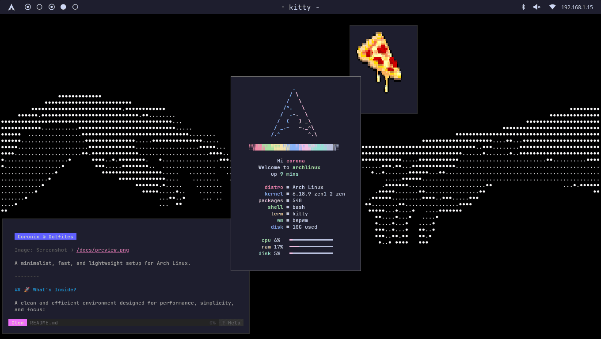

# Coronix ⨳ Dotfiles



A minimalist, fast, and lightweight setup for Arch Linux.

---

## 🚀 What's Inside?

A clean and efficient environment designed for performance, simplicity, and focus:

* **`bspwm`** → Lightweight window manager
* **`sxhkd`** → Simple and customizable keybindings
* **`kitty`** → Fast and modern terminal
* **`neovim`** + **`tmux`** → Powerful text editing and multitasking
* **`starship`** → Beautiful and informative prompt
* **Terminal utilities** → `bat`, `eza`, `ripgrep`, `yazi`, and more

No bloat. Just the essentials.

---

## ⚡ Quick Installation

For an optimized experience, it's recommended to install **Arch Linux** using the `bspwm` profile with `archinstall`.

### 1. Clone the repository:

```bash
git clone https://github.com/VictorzllDev/dotfiles.git
```

### 2. Run the installation script:

```bash
cp dotfiles/install.sh
./install.sh
```

---

<p align="center"><i>By VictorzllDev ☕</i></p>
